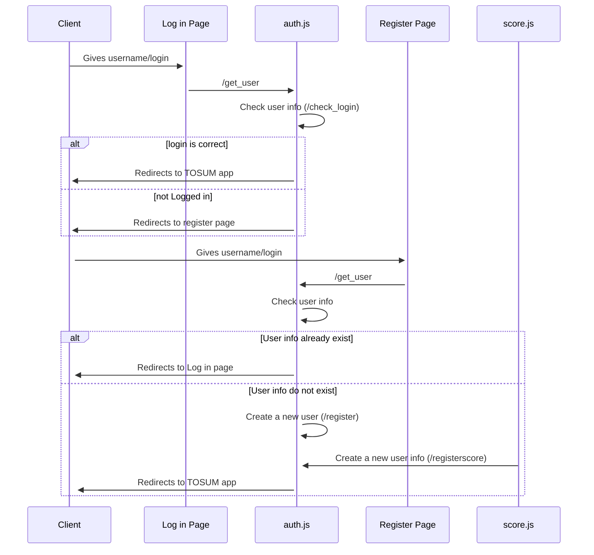
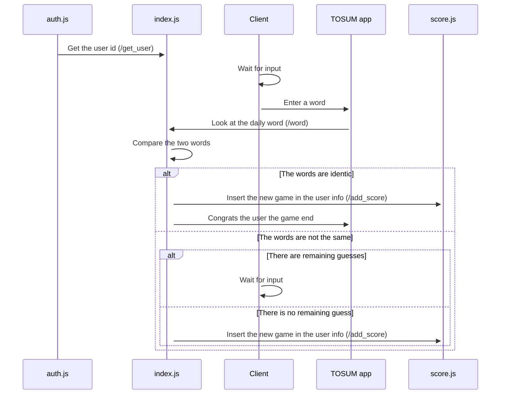
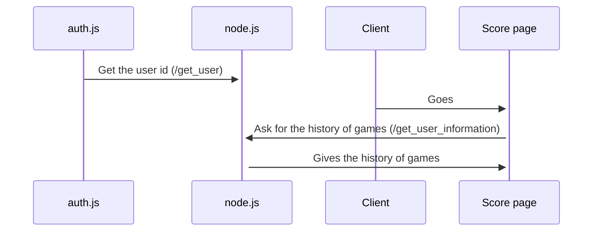

<a name="readme-top"></a>
<!-- PROJECT LOGO -->
<br />
<div align="center">
  <a href="https://github.com/JulienDelages/Tosum">
    
  </a>

<h3 align="center">TOSUM</h3>

  <p align="center">
    Inspired by <a href="https://sutom.nocle.fr"><strong>SOTUM</strong></a> website
    <br />
    <a href="https://github.com/JulienDelages/Tosum"><strong>Explore the docs »</strong></a>
</div>

### Description 

Microservice course's project on reproducing the <a href="https://sutom.nocle.fr"><strong>SOTUM</strong></a> website. This project is composed by 3 micro-services:
* A login api that allow the user to create or log in into an account.
* The TOSUM app which consist of the reproduction of the MOTUS or WORDLE game. Each day you have a random word to find with a given amount of try. If the word you entered has a letter at the right place, its color become green, if it is in the word but not at the right place, its color become yellow, otherwise its stays gray.
* A score api that shows the user its statistics from his past games.

#### Authentification

#### TOSUM game


#### Score


### Installation

1. Clone the repo
    ```sh
    git clone https://github.com/JulienDelages/Tosum.git
    ```
2. Make sure to download docker <a href="https://docs.docker.com/desktop/install/windows-install/"><strong>here</strong></a>    
    
3. Mount the app
    ```
    docker-compose up -d
    ``` 
4. Go to http://localhost:4000

<p align="right">(<a href="#readme-top">back to top</a>)</p>

## Contact

Fedi Lahmar - lahmarfedi@cy-tech.fr

Julien Delages - delagesjul@cy-tech.fr

<p align="right">(<a href="#readme-top">back to top</a>)</p>

