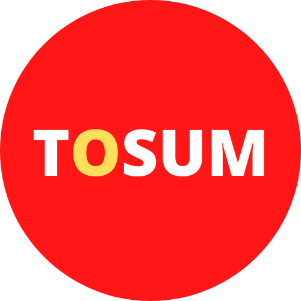
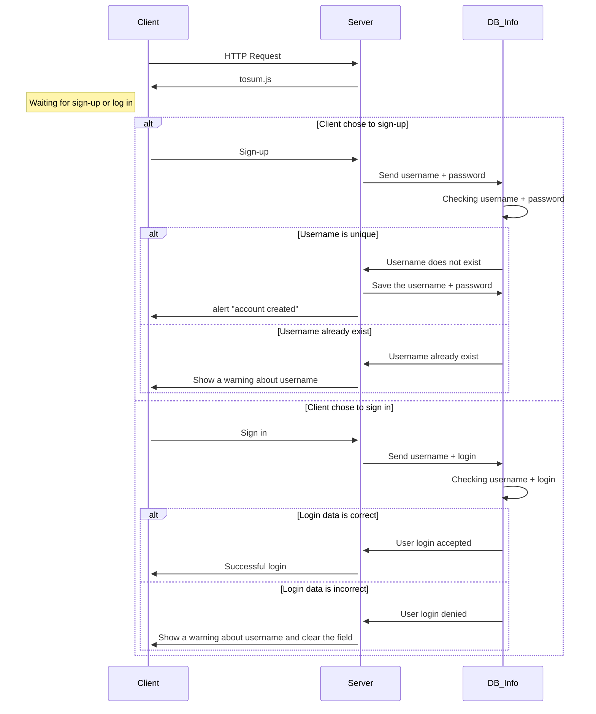

<a name="readme-top"></a>
<!-- PROJECT LOGO -->
<br />
<div align="center">
  <a href="https://github.com/JulienDelages/Tosum">
    
  </a>

<h3 align="center">TOSUM</h3>

  <p align="center">
    Inspired by <a href="https://sutom.nocle.fr"><strong>SOTUM</strong></a> website
    <br />
    <a href="https://github.com/JulienDelages/Tosum"><strong>Explore the docs »</strong></a>
</div>

### Description 

Microservice course's project on reproducing the <a href="https://sutom.nocle.fr"><strong>SOTUM</strong></a> website.



### Installation

1. Clone the repo
    ```sh
    git clone https://github.com/JulienDelages/Tosum.git
    ```
2. Install NPM packages
    ```sh
    npm install
    ```
3. Mount the app
    ```
    node tosum.js
    ``` 
4. Go to http://localhost:3000

<p align="right">(<a href="#readme-top">back to top</a>)</p>

## Contact

Fedi Lahmar - lahmarfedi@cy-tech.fr

Julien Delages - delagesjul@cy-tech.fr

<p align="right">(<a href="#readme-top">back to top</a>)</p>

